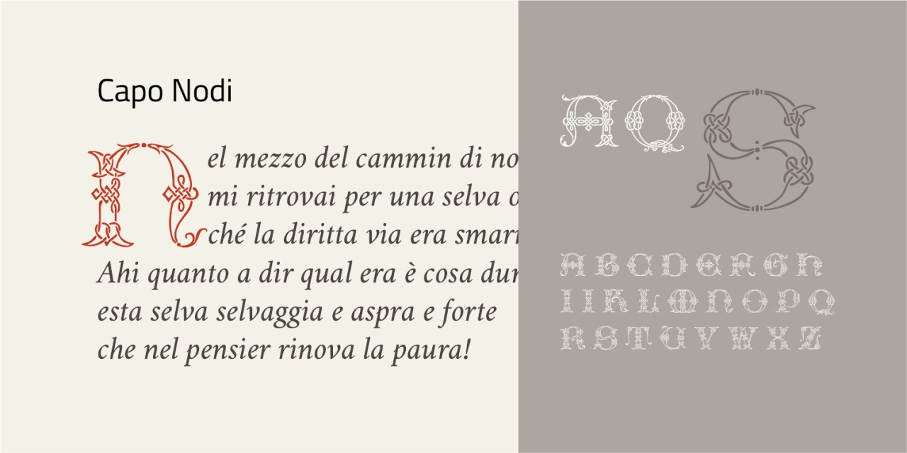
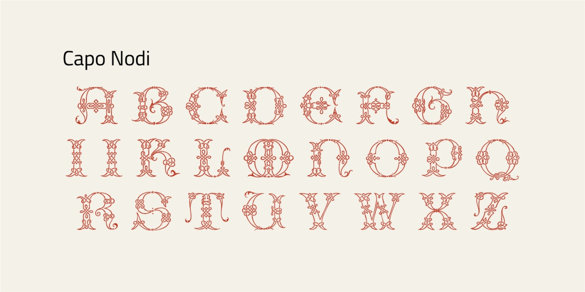

# Capo Nodi
* Versione 1.0: versione iniziale

Per testare il font, vedere la [pagina interattiva](https://m-casanova.github.io/CapoNodi/).

## Descrizione

Il font _Capo Nodi_ è basato sui capolettera italiani del Cinquecento riprodotti in _[Muster-Alphabete : verschiedener Schriftarten in den neuesten Formen](https://archive.org/details/musteralphabetev09unse/page/n7/mode/2up)_ (1880).
I caratteri sono simili a quelli di Giovanni Antonio Tagliente, [pubblicati nel 1539](https://archive.org/details/lopresentelibroi00tagl/page/n47/mode/2up).

Trattandosi di un capolettera, sono presenti solo le lettere maiuscole. Manca la lettera Y.

